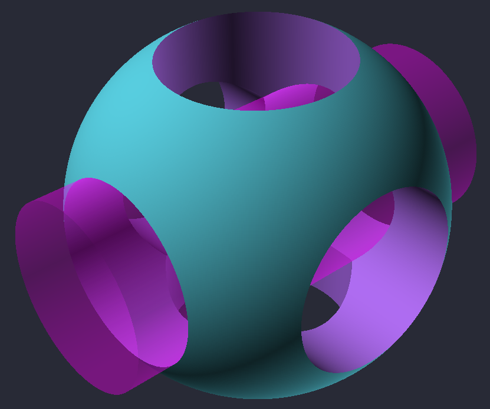

# OpenSCAD DSL for OCaml

## Overview

In conjunction with [OCADml](https://github.com/OCADml/OCADml), this library
provides an OCaml front-end to the [OpenSCAD](https://openscad.org/) solid
modelling language. All SCAD primitives and transformation functions are made
available.

## Notable differences from the OpenSCAD language

- Angles are represented in radians (and converted to degrees when compiling to OpenSCAD).
- `linear_extrude` and `rotate_extrude` have been renamed to `extrude` and `revolve`
- The dimensional system (2D or 3D) each shape inhabits is tracked by the type
  system. This is used to restrict the operations that can be legally applied
  (e.g. 2D shapes cannot be moved off of the xy plane, `extrude` can only
  be applied to 2D shapes) and enforcing non-mixing of 2D and 3D shapes during
  boolean operations.

## Usage

``` ocaml
open OCADml
open OSCADml

let () =
  let scad_logo =
    let rad = 5.
    and fn = 720 in
    let cyl = Scad.cylinder ~fn ~center:true ~height:(rad *. 2.3) (rad /. 2.) in
    let cross_cyl = Scad.rotate (v3 0. (Float.pi /. 2.) 0.) cyl in
    Scad.union
      [ Scad.difference
          (Scad.sphere ~fn rad)
          [ cyl; cross_cyl; Scad.rotate (v3 0. 0. (Float.pi /. 2.)) cross_cyl ]
      ; Scad.color ~alpha:0.25 Color.Magenta cross_cyl
      ]
  in
  Scad.to_file "scad_logo.scad" scad_logo
```


Generated scads can then be viewed with the [OpenSCAD
viewer](https://openscad.org/downloads.html) as you normally would.

## Documentation

Documentation for OSCADml is available
[online](https://ocadml.github.io/OSCADml/OSCADml/index.html) and offline via
[odig](https://erratique.ch/software/odig), covering the
[API](https://ocadml.github.io/OSCADml/OSCADml/index.html#api) as well as some
walkthrough style
[examples](https://ocadml.github.io/OSCADml/OSCADml/index.html#examples).
Referring to the [manual](https://ocadml.github.io/OCADml/OCADml/index.html) for
[OCADml](https://github.com/OCADml/OCADml) is also likely to be helpful.

## Companion PPX

There is a companion ppx, [\[@@deriving
cad\]](https://github.com/OCADml/ppx_deriving_cad) for generating
transformation functions for user-defined records and abstract types made up of
the `Scad.t`, along with their corresponding vector (`V2.t` or `V3.t`) types
(and those composed of them) provided in the
[OCADml](https://github.com/OCADml/OCADml) library.

## Generating models on write

For a more pleasant modelling experience, it is highly recommended to setup [dune](https://github.com/ocaml/dune) to
automate writing your models to file whenever the source files are saved. To do
so, add a [dune rule](https://dune.readthedocs.io/en/latest/dune-files.html#rule)
that runs your projects executable after it is built. For example, in `your_project/bin/dune`:

``` dune
(executable
 (public_name your_project)
 (name main)
 (libraries OCADml OSCADml))

(rule
 (alias model)
 (action
  (run your_project)))
```

Then start `dune` in [watch
mode](https://dune.readthedocs.io/en/latest/usage.html#watch-mode) with `dune
build -w @model`.
